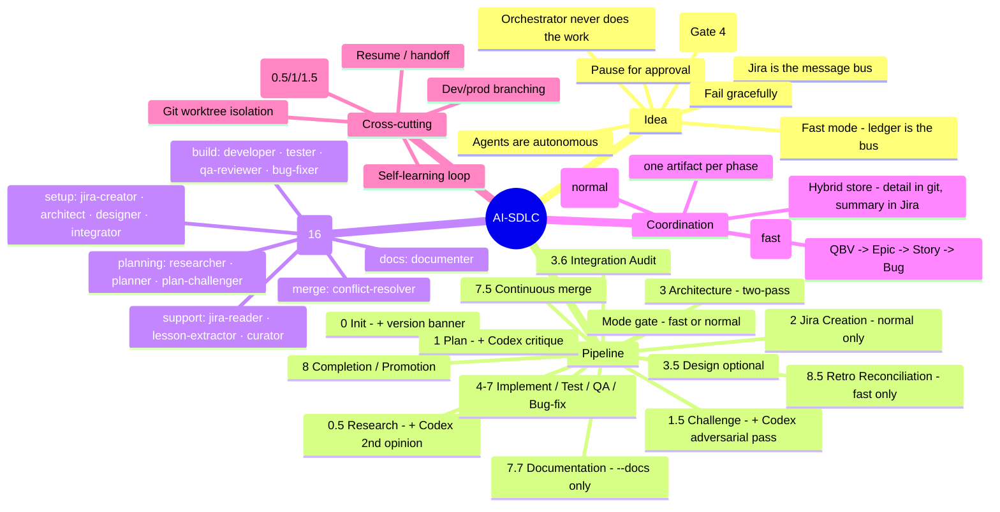
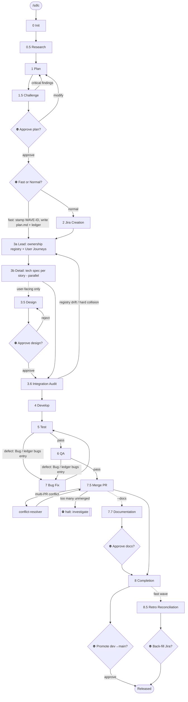
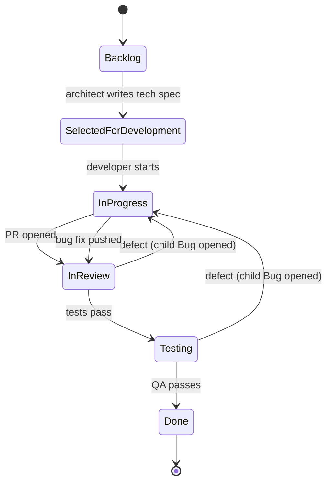
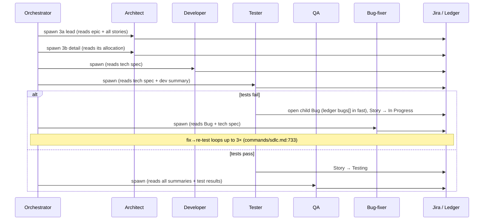
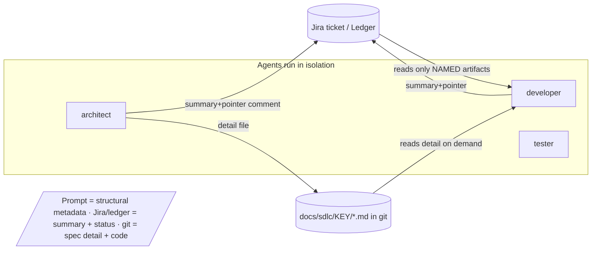

# AI-SDLC — How the System Works

> **How to read this.** The doc goes idea → flow → decisions, then splits by who you are.
> Start at [The Idea](#the-idea). If you just want to *use* it, read through
> [The Flow](#the-flow) and stop at the [First-time user](#for-a-first-time-user) view. If you
> *run* it on real projects, continue to the [Operator](#for-an-operator) view. If you want to
> *change* it, read the [Contributor](#for-a-contributor) view.
>
> Facts are cited as `file:line` against the source. They were true when this was written;
> the pipeline changes, so treat a mismatched citation as a signal to regenerate, not as truth.

---

## The Idea

AI-SDLC is an **automated software development lifecycle**. You start it with one command —
`/sdlc "build me X"` — and a single **orchestrator** drives a project from a rough description
all the way to merged, tested code, coordinating a team of specialized AI agents along the way.

The load-bearing concepts, straight from the source:

- **Jira is the message bus.** Agents don't talk to each other. Each one reads its inputs from a
  Jira ticket and writes its output back as a ticket comment; the ticket's *status* is how the
  orchestrator knows what to do next. **In fast mode (`Jira: off`) that message bus becomes the
  Fast Work Ledger** — an orchestrator-held git + resume file — and agents return their verdict in
  return text instead of writing Jira. (`commands/sdlc.md:12`, `skills/sdlc-conventions/SKILL.md:15`)
- **Agents are autonomous and isolated.** Each runs on its own with full context pulled from its
  inputs — no shared memory, no side channels. (`commands/sdlc.md:13`)
- **The orchestrator coordinates but never does the work itself.** It does not write code, fix bugs,
  write tests, or do QA — *even a one-line fix goes through an agent* so the work stays tracked and
  follows the pipeline. This is the counter-intuitive rule that makes the whole thing consistent:
  the value comes from never taking shortcuts. (`commands/sdlc.md:17-18`)
- **The pipeline pauses for you.** It stops and asks for approval at specific gates — after
  planning, before UI development, and before promoting to production — plus a one-line
  fast-vs-normal choice at the start of each wave. You are always in the loop at the moments that
  matter. (`commands/sdlc.md:14`, `commands/sdlc.md:422-446`)
- **It fails gracefully.** Retries are bounded; when a loop can't converge, it flags the work for a
  human instead of spinning forever. (`commands/sdlc.md:15`)
- **"Tested" means all three layers, in the target environment.** "Done" requires **code *and*
  config *and* infra** verified in the actual deploy-target runtime (behind the real front
  door/gateway), not just backend unit tests green in dev. Deployment manifests, env/secret files,
  orchestration specs, proxy/gateway config, container images — whatever form the target repo uses
  — are owned artifacts the architect allocates and the tester asserts against (**Gate 4**).
  Coverage of one layer is not coverage of the failure surface. (`commands/sdlc.md:20`)

Here's the whole system in one picture — the parts and how they group:



*(Agent count and phase list derived from `ls agents/*.md` — 16 files — and the `## Phase`
headings in `commands/sdlc.md:185-912`. Codex is an **external** subagent — `codex:codex-rescue`
from the `codex` plugin — not one of the 16 SDLC agents.)*

---

## The Flow

Work moves through numbered **phases**. The numbering is not 1..8 — it has fractional phases
(`0.5`, `1.5`, `3.5`, `3.6`, `7.5`, `7.7`, `8.5`) that were inserted as the pipeline matured, and
one combined phase (`4-7`) that is really a per-story loop. Read them off the source, never assume
the count. (`commands/sdlc.md:185-912`)

Two phases are **mode-conditional**: Phase 2 (Jira creation) runs only in **normal** mode, and
Phase 8.5 (retro reconciliation) runs only in **fast** mode. A one-line gate right after plan
approval picks the mode for the whole wave. (`commands/sdlc.md:422-446`)

> **File order ≠ numeric order.** In `commands/sdlc.md` the *Mode selection* (`:422`) and
> *Fast-path phase routing* (`:460`) sections physically precede *Phase 2* (`:502`), because fast
> mode skips Phase 2 entirely. The numeric phase order below is the logical flow.

| Phase | Name | Who runs it | What it produces | Gate? |
|------:|------|-------------|------------------|-------|
| 0 | Initialization | orchestrator | version banner, context block, transition map, agent paths, branching model | — |
| 0.5 | Research (build-vs-buy) | `sdlc-researcher` *(+ Codex 2nd opinion)* | OSS survey report (advisory) | — |
| 1 | Planning | `sdlc-planner` *(+ Codex critique → reconcile)* | epic/story breakdown with acceptance criteria | — |
| 1.5 | Plan Challenge | `sdlc-plan-challenger` *(+ Codex adversarial pass)* | adversarial findings + verdict | — |
| — | **Approve the plan** | **user** | plan approved (or sent back) | ⛔ **pause** |
| — | **Fast or normal?** | **user** | mode for the wave (fast skips Jira ceremony) | ⛔ **pause** |
| 2 | Jira Ticket Creation *(normal only)* | `sdlc-jira-creator` | QBV + epics + stories in Jira | — |
| 3a | Architecture — lead | `sdlc-architect` | **User Journeys** + **ownership registry** (who-owns-what) | — |
| 3b | Architecture — detail | `sdlc-architect` (parallel) | tech spec + names-reserved per story | — |
| 3.5 | Design *(optional)* | `sdlc-designer` | design spec for user-facing stories | ⛔ **pause** |
| 3.6 | Integration Audit | `sdlc-integrator` | registry-drift / collision confirmation | — |
| 4 | Develop | `sdlc-developer` | code, commit, PR → *In Review* | — |
| 5 | Test | `sdlc-tester` | tests + results; mandatory smoke-path + live-process E2E for user-facing stories | — |
| 6 | QA Review | `sdlc-qa-reviewer` | QA verdict → *Done* or a Bug | — |
| 7 | Bug Fix | `sdlc-bug-fixer` | fix → back to *In Review* | — |
| 7.5 | Continuous merge | orchestrator / `sdlc-conflict-resolver` | Done PRs merged into base | ⛔ pause *if pile-up* |
| 7.7 | Documentation *(`--docs` only)* | `sdlc-documenter` | README/docs/Confluence proposal | ⛔ **pause** |
| 8 | Completion + Promotion | orchestrator | epic summary, epic-level user-journey replay, dev→main promotion | ⛔ **pause** |
| 8.5 | Retro Reconciliation *(fast only)* | `sdlc-jira-creator` (reconcile) | back-filled QBV→Epic→Story→Bug in Jira | ⛔ **pause** |

*(Phases and owners from `commands/sdlc.md:185-912`; owner-to-model mapping from the table at
`commands/sdlc.md:80-98`.)*

> **Term note.** This doc says **User Journey** for what the source names a **Critical User Journey
> (CUJ)** — an end-to-end flow a real user must be able to complete after the epic ships. It's the
> same thing: the artifact header is literally `## Critical User Journeys` and the detail file is
> `docs/sdlc/{EPIC}/cujs.md`, so those exact strings (which you'd grep for) are kept verbatim below.
> (`agents/sdlc-architect.md:79,83`)

**Codex second opinion (planning phases only).** In Phases 0.5, 1, and 1.5 the orchestrator brings
**Codex (GPT-5.x)** in as an independent second model, via the external `codex:codex-rescue`
subagent, **read-only** — a diversity-of-models check on the research (0.5), the draft plan (1), and
the plan's weaknesses (1.5). Codex *advises*; the Claude agent always owns the artifact ("consult,
Claude reconciles"). It's **on by default**, disabled with `--no-codex`, and **auto-skips
gracefully** (one log line) if Codex isn't installed/authenticated — so a missing Codex never blocks
a run. In **Phase 1.5 a Codex *critical* finding is binding** — same LOOPBACK weight as a challenger
critical; everywhere else it is advisory. Full contract: `sdlc-conventions` → "Codex Consult
Protocol". (`commands/sdlc.md:366,387,408,411`, `skills/sdlc-conventions/SKILL.md:320`)

The same thing as a flowchart, with the loops, gates, and the fast/normal split drawn in — the
loops and the mode branch are the point, so they're not hidden:



*(Mode gate `commands/sdlc.md:422-460`; two-pass architecture `commands/sdlc.md:532-576`;
challenge loopback `commands/sdlc.md:411`; integration-audit loopback `commands/sdlc.md:632`;
defect loop `commands/sdlc.md:711-733`; merge-conflict route `commands/sdlc.md:767`; drift
halt `commands/sdlc.md:799-803`; docs gate `commands/sdlc.md:832`; reconcile gate
`commands/sdlc.md:916-923`.)*

### How a ticket moves (the state machine)

The *phases* are what the pipeline does; the *statuses* are where a Story ticket sits. They're
orthogonal. A Story walks this path (`skills/sdlc-conventions/references/workflow-states.md:5`,
`workflow-states.md:9-12`):



> **A Bug is a *type*, not a status.** When the tester or QA finds a defect, they open a **child
> Bug issue** parented to the Story and move the Story back to *In Progress*. While that Bug is
> open, the parent Story sits in *In Progress*. You detect "is this Story in the bug loop?" by
> querying its children (`parent = X AND issuetype = Bug AND status != Done`), **not** by reading
> the Story's own status. (`workflow-states.md:7,47,50`)

> **In fast mode there are no tickets** — a per-unit **ledger `phase`** stands in for the status,
> mapping 1:1 to these statuses so a wave can be faithfully rebuilt in Jira later:
> `architected → ready → in-progress → in-review → testing → done` (plus `blocked`). Ledger
> `bugs[]` entries stand in for child Bug issues, with the same 3-loop cap.
> (`workflow-states.md:59-75`)

---

## For a First-time User

**What you're actually driving.** You are not chatting with a coder. You're starting a pipeline
and approving it at a few checkpoints. Everything in between runs on its own.

**How to start:**
- `/sdlc "a description of what you want"` — brand-new project (`commands/sdlc.md:159`)
- `/sdlc /path/to/plan.md` — start from a plan file you already wrote (`commands/sdlc.md:154`)
- `/sdlc CSI-123` — **resume** a normal-mode epic where you left off (`commands/sdlc.md:155`)
- `/sdlc continue` (or `continue {WAVE-ID}`) — **resume a fast-mode wave** by its wave id
  (fast waves have no Jira epic key) (`commands/sdlc.md:158`)

**Fast vs normal — the one new choice.** Right after you approve the plan, the pipeline recommends
**fast** or **normal** in one line and lets you pick (`commands/sdlc.md:422-446`):
- **Normal** — Jira is the message bus as you go; every ticket transition and comment is live so
  stakeholders can watch the board. Best for large multi-epic projects and multiple stakeholders.
- **Fast** — skips **only the Jira ceremony** during the build (no tickets, transitions, comments,
  or Bug issues) while keeping **every engineering gate** — planner, challenger, architect,
  designer, integrator, developer, tester (incl. smoke-path + live-process real-browser E2E), QA,
  bug-fixer, and PR merge. Coordination moves to a local ledger; when the wave finishes it *offers
  to create the tickets in retrospect*. Best when you're driving live and the wave is small.
  (`commands/sdlc.md:167`, `skills/sdlc-conventions/SKILL.md:197,199`)

You can pre-answer with `--fast` / `--normal`, or let `--auto` take the recommendation. You can also
pass `--no-codex` to skip the Codex second opinion in the planning phases (it runs by default).
(`commands/sdlc.md:165-170`)

**The moments it will stop and wait for you** — this is what you'll actually experience:

1. **After planning** — it shows you the epic/story breakdown *plus* an adversarial review of that
   plan, and asks *"Approve this plan? Or modify?"*. Nothing gets created until you say yes.
   (`commands/sdlc.md:413-418`)
2. **Fast or normal?** — a one-line recommendation you confirm. (`commands/sdlc.md:428-446`)
3. **Before building anything with a user interface** — if a story has a UI, CLI output, or a
   dashboard, a designer proposes the look and asks *"Approve this design? Or modify?"* before any
   code is written. Pure backend stories skip this. (`commands/sdlc.md:603-606`)
4. **If you passed `--docs`** — after everything's merged, it proposes README/docs/Confluence
   updates for you to approve. (`commands/sdlc.md:832`)
5. **Before going to production** — when everything's done on `dev`, promotion to `main` happens
   only when you explicitly ask. (`commands/sdlc.md:893`)
6. **After a fast wave** — it offers to back-fill the Jira tickets in retrospect.
   (`commands/sdlc.md:916-923`)

Between those, it plans, (optionally files tickets), designs the architecture, writes the code,
tests it (real browser tests for anything user-facing), reviews it, fixes its own bugs, and merges
the PRs.

**One thing that surprises people:** if the plan has a serious flaw, an internal "challenger"
catches it and sends it back for a rewrite *before you ever see it* — and by default a **second,
independent AI model (Codex)** stress-tests the plan too. So the plan you're asked to approve has
already survived two models' scrutiny, not one. (`commands/sdlc.md:394-420`, `commands/sdlc.md:408`)

---

## For an Operator

You're running this on a live project and need to recognize every state, every pause, and which
mode you're in.

### Which build am I running?

The **very first line** of every run is a version banner — printed on all entry paths (fast
resume, fast-mode wave, or full init) before any other Phase 0 work:

```
🔧 ai-sdlc v{version} · commit {short-sha} · source {marketplace-or-checkout name}
```

It reads `version` from `.claude-plugin/plugin.json` and derives the commit from either the
content-addressed cache path segment or `git rev-parse` on a live checkout. This exists because the
plugin cache refreshes on Claude Code's schedule, not on your push — so a session can silently run
a **stale** build lacking recent fixes/gates. If someone reports odd behavior, scroll to the banner
first. It's a report, never a gate (`commit unknown` if it can't be derived).
(`commands/sdlc.md:185-198`)

### Which mode am I in?

- **Normal** — you watch progress on the Jira board; each phase posts one comment and transitions
  the ticket. The rest of this section's status/artifact tables apply directly.
- **Fast (`Jira: off`)** — there is **no board to watch during the build**. State lives in the
  **Fast Work Ledger** at `docs/sdlc/_wave-{WAVE-ID}/ledger.md` (also mirrored in the resume file),
  committed to git after every phase. Units get synthetic keys `{PROJECT}-F1`, `{PROJECT}-F2`, …;
  requirements live in `docs/sdlc/_wave-{WAVE-ID}/plan.md`. The board fills in only if you accept
  the Phase 8.5 retro reconciliation. (`commands/sdlc.md:460-500`,
  `skills/sdlc-conventions/SKILL.md:197,199`)

### Reading the board (normal mode)

Use the [state machine above](#how-a-ticket-moves-the-state-machine). The exact status strings you
will see are: **Backlog · Selected for Development · In Progress · In Review · Testing · Done**
(synonyms `To Do` / `Ready for Dev` are mapped at Phase 0).
(`workflow-states.md:5-12`)

Under the **hybrid artifact store**, each phase posts **one summary+pointer comment** on the ticket
whose header tells you it succeeded — the *detail* lives in a git file under `docs/sdlc/{KEY}/`, not
in Jira. Watch for these headers (`skills/sdlc-conventions/SKILL.md:119-155`, `commands/sdlc.md` per-phase Write Artifact lines):

| Phase | Artifact header (Jira comment) | Detail file in git | Status it moves to |
|------|--------------------------------|--------------------|--------------------|
| Architecture 3a | `## Critical User Journeys` + `## Ownership Registry` (epic) | `docs/sdlc/{EPIC}/cujs.md`, `ownership.md` | — |
| Architecture 3b | `## Technical Specification` (story) | `docs/sdlc/{STORY}/tech-spec.md`, `names-reserved.md` | Selected for Development |
| Design | `## Design Specification` | `docs/sdlc/{STORY}/design-spec.md` | (stays, awaits approval) |
| Integration | `## Integration Notes` (only if collisions) | `docs/sdlc/{STORY}/integration-notes.md` | — |
| Develop | `## Implementation Complete` | — (code in the worktree) | In Review |
| Test | `## Test Results` | — | Testing (pass) / In Progress (fail) |
| QA | `## QA Review` | — | Done (pass) / In Progress (fail) |
| Bug fix | `## Bug Fix Complete` | — | In Review |
| Merge | `## Merge Result` | — | (Done, PR merged) |

*(Headers cited at `commands/sdlc.md:543,558,597,625,681,691,707,728,785`.)*

### The decision points and their caps

Every place the flow branches, and — critically — **where it stops and asks you**:

```mermaid
flowchart TD
  subgraph challenge[Phase 1.5 — plan challenge]
    C{verdict?} -->|CLEAR| Cok[proceed to approval]
    C -->|SURFACE important| Csurf[show findings + proceed to approval]
    C -->|LOOPBACK critical: challenger OR Codex| Cre[re-plan]
    Cre -.->|after 2 iterations still critical| Chuman[[⛔ halt: user triages]]
  end
  subgraph arch[Phase 3 — two-pass architecture]
    L[3a lead: allocate ownership registry] --> Dt[3b detail: reserve only within slice]
    Dt -->|registry gap| L
    Dt --> IA{3.6 audit: within allocation?}
    IA -->|Action required: 0| Iok[proceed to develop]
    IA -->|drift / collision| L
    IA -.->|after 2 audit iterations| Ihuman[[⛔ halt: user triages]]
  end
  subgraph bug[Phases 5/6/7 — defect loop]
    B{pass?} -->|pass| Badv[advance]
    B -->|fail| Bfix[open child Bug / ledger bug → fix → re-test]
    Bfix --> B
    B -.->|after 3 bug-fix loops| Bblock[[flag blocked, move on]]
  end
  subgraph merge[Phase 7.5 — merge drift]
    M{merges clean?} -->|yes| Mok[Done, PR merged]
    M -->|multi-PR conflict| Mcr[conflict-resolver unions safe collisions]
    M -.->|unmerged Done PRs > MAX default 5| Mhalt[[⛔ halt: investigate pile-up]]
  end
```



The caps you must know, verbatim from source:

- **Plan challenge:** verdicts are **CLEAR / SURFACE / LOOPBACK**; at most **2 challenge iterations**
  per session; a third still-critical round halts for you to triage.
  (`commands/sdlc.md:411-413`)
- **Codex consult (planning only):** in Phases 0.5/1/1.5 an independent second model (Codex, via
  `codex:codex-rescue`, read-only) advises — on by default, `--no-codex` disables, **auto-skips**
  if Codex is unavailable. In **Phase 1.5 a Codex *critical* is binding** (counts toward LOOPBACK,
  same as a challenger critical); everywhere else it is advisory and the Claude agent reconciles.
  (`commands/sdlc.md:366,387,408,411`, `skills/sdlc-conventions/SKILL.md:320`)
- **Architecture (two-pass):** the **lead pass** allocates every file/symbol/route/CLI/env name and
  shared wire-contract schema to exactly one owning story so detail architects can't collide; a
  `Registry gap:` from a detail architect re-runs the lead pass, capped at **2 lead-pass
  iterations** per epic. (`commands/sdlc.md:536,551`, `skills/sdlc-conventions/SKILL.md:157-195`)
- **Integration audit:** with the registry in place this is a **confirmation gate** — it verifies
  each story stayed within its allocation and should almost always return `Action required: 0`;
  drift re-runs Phase 3, capped at **2 audit iterations** per epic. (`commands/sdlc.md:617,632`)
- **Bug-fix loop:** a Story goes through fix → re-test at most **3 times**; after that it's flagged
  blocked and the pipeline moves on (counted from ledger `bugs[].loop` in fast mode).
  (`commands/sdlc.md:733`, `workflow-states.md:57,73`)
- **Merge drift:** if more than `MAX_UNMERGED_DONE_PRS` (env, **default 5**) Done PRs are unmerged,
  the pipeline **halts** and asks you to investigate — this is the conflict-pile-up alarm Phase 7.5
  exists to trip. (`commands/sdlc.md:747,799-803`)

### One story's life, across agents



*(In fast mode the "Jira / Ledger" participant is the Fast Work Ledger + git spec files; the
transitions above are ledger `phase` updates the orchestrator drives from each agent's return text
— `commands/sdlc.md:460-500`.)*

### Pausing and resuming safely

- **Auto-save** happens at batch boundaries and when context runs high — a resume file is written
  with no confirmation. (`commands/sdlc.md:953`)
- **Explicit handoff** — say "pause" / "stop" / "save progress" and it runs the full `sdlc-handoff`
  skill: scans git state, offers a checkpoint commit, captures decisions/blockers.
  (`commands/sdlc.md:993`)
- **Resume a normal epic** with `/sdlc CSI-123`; Phase 0 fast-resume reloads the cached context and
  only re-routes stories whose status drifted. (`commands/sdlc.md:204`)
- **Resume a fast wave** with `/sdlc continue` (bare picks the most recent unreconciled wave) or
  `/sdlc continue {WAVE-ID}` — it rebuilds state from the wave id + the Fast Work Ledger, since a
  fast wave has no Jira epic key. (`commands/sdlc.md:158,229`)

### Self-learning (it improves itself)

As the pipeline runs, hooks capture two kinds of lessons — **your corrections** and agents'
self-reported `## Lessons` — into an append-only journal. The orchestrator "drains" that queue,
spawns `sdlc-lesson-extractor` to classify each, and surfaces a **proposal** for your approval
before changing any canonical file. The inverse also exists: `/sdlc lessons curate` spawns
`sdlc-curator` to propose **removals/consolidations** of stale or duplicated rules. Toggle the
whole loop with `/sdlc lessons on|off`. (`commands/sdlc.md:1005,1009`)

---

## For a Contributor

You want to add or modify an agent or a phase without breaking coordination. Read the source files
by the paths below — this section is the map, not a substitute for reading them.

### The coordination contract

Agents never call each other. They share context through named artifacts, and — under the
**hybrid artifact store** — the *detail* of each artifact lives in a git file while only a
**summary + pointer** goes into Jira (`skills/sdlc-conventions/SKILL.md:82-97,119-155`):



The discipline that keeps this cheap (`skills/sdlc-conventions/SKILL.md:82-155`):

- **One artifact per phase.** Each agent posts exactly one comment at the end of its phase; the
  orchestrator's prompt names which prior artifacts it may read. Agents do **not** scan the whole
  thread. If an agent needs something not listed, it stops and asks.
- **Summary-first + detail in git.** Every Jira comment opens with a `## Summary` and a `📄 Detail:`
  pointer to a file under `docs/sdlc/{KEY}/`; the heavy content (tech specs, ownership registry,
  design specs, integration notes) is committed to git, not pasted into Jira. This is what makes
  fast mode possible — the content is already local, so Jira status can be dropped.
  (`skills/sdlc-conventions/SKILL.md:119-155,197`)
- **Never store** full test output, code snippets, restated requirements, or file contents in Jira —
  reference commit SHA + path; the worktree is the source of truth.
  (`skills/sdlc-conventions/SKILL.md:280-283`)

### Two-pass architecture (why Phase 3 is split)

Boundary-setting is a **global-consistency** problem: if N architects each design one story in
isolation, two can independently reserve the same file/symbol/route/schema, and the collision only
surfaces later at the integrator — forcing an expensive re-architecture loop. So Phase 3 runs in
**two passes** (`skills/sdlc-conventions/SKILL.md:157-195`, `commands/sdlc.md:532-576`):

- **3a — lead pass (serial, once):** one architect writes the epic **User Journeys** (source term:
  *Critical User Journeys*, header `## Critical User Journeys`, file `cujs.md`) and the **ownership
  registry** (`ownership.md`) allocating every name to exactly one owning story.
- **3b — detail pass (parallel):** one architect per story reads its allocation and reserves
  **only within its slice** — so collisions can't form.

With the registry in place, **Phase 3.6 drops from a rework trigger to a confirmation gate** that
just verifies each story's `names-reserved.md` is a subset of its allocation. For old epics with no
`ownership.md`, the integrator falls back to the full independent cross-check.

### Second-model consult (Codex)

The one place the pipeline calls a **non-Claude** model. In the planning phases only (0.5/1/1.5) the
orchestrator spawns the external **`codex:codex-rescue`** subagent read-only to get an independent
second opinion, then the Claude agent reconciles — Codex never owns an artifact and never writes the
repo or Jira. This is the **one exception** to "spawn every agent as general-purpose": `codex:codex-rescue`
is a typed subagent from the `codex` plugin and needs no MCP access. It's **on by default**;
`--no-codex` disables it (persisted to the resume file's `## Codex` block); it **auto-skips
gracefully** if Codex isn't set up, so it never blocks a run. The full contract — invocation, the
read-only framing, the bounded output contract, the graceful-skip, and the per-phase reconciliation
owner (0.5 append → planner reconciles; 1 planner re-spawn reconciles the critique; 1.5 orchestrator
merges findings, a Codex critical is binding) — lives in `sdlc-conventions` → "Codex Consult
Protocol". (`skills/sdlc-conventions/SKILL.md:320`, `commands/sdlc.md:170,225,366,387,408,411`)

### Fast mode (the `Jira:` axis)

Fast mode is a major recent addition. It skips **only** the Jira ceremony during the build and
keeps every engineering gate. Mechanically (`commands/sdlc.md:460-500`,
`skills/sdlc-conventions/SKILL.md:197-278`, `workflow-states.md:59-75`):

- After plan approval the mode gate stamps a `WAVE-ID = {PROJECT}-W{timestamp}`, assigns synthetic
  keys `{PROJECT}-F{n}`, writes `docs/sdlc/_wave-{WAVE-ID}/plan.md`, and initializes the **Fast Work
  Ledger** (`ledger.md` + resume-file block). Phase 2 is skipped entirely.
- Every fast spawn's context block carries `Jira: off` + `WAVE-ID`; agents skip the Jira MCP tools,
  read requirements from `plan.md`, write their detail to the named git file, and return their
  verdict in return text. The orchestrator advances each unit's ledger `phase` from that return.
- Phase 7.5 (PR merge) is byte-for-byte unchanged — it operates on git/GitHub, not Jira.
- **Phase 8.5 retro reconciliation** (opt-in at wave end) spawns `sdlc-jira-creator` in reconcile
  mode to back-fill the full QBV → Epic → Story(→ Bug) hierarchy, each walked to its recorded final
  status via the ledger↔status map. (`commands/sdlc.md:912-923`, `workflow-states.md:63-75`)

Full design: `docs/specs/2026-07-19-ai-sdlc-fast-mode-design.md`.

### On the roadmap (not yet wired in)

- **Delivery lifecycle.** A design for teaching AI-SDLC the full dev→stg→prod lifecycle — branch
  strategy, environments, CI/CD, remote deploy + smoke, and in-app docs as a decided/persisted/
  replayed **Delivery Model** contract — is **approved but not yet implemented**. No live
  orchestrator, conventions, or agent behavior references it today; it exists only as
  `docs/specs/2026-08-05-ai-sdlc-delivery-lifecycle-design.md`. When it lands, expect a new
  Delivery Model artifact in Phase 0/3 and deploy/smoke gates around Phase 8. Until then, the
  live "path to prod" is the Phase 8 dev→main promotion described above.

### How agents are spawned (the part that trips people up)

Plugin subagents **cannot access MCP tools** — a Claude Code platform limitation. Every SDLC agent
needs Jira MCP access, so they are **all** spawned as **general-purpose agents** via `Agent()` with
**no `subagent_type`**. (The lone exception is the Codex consult above, which is a typed
`codex:codex-rescue` subagent and needs no MCP.) (`commands/sdlc.md:25,78,101`)

The spawn is **pointer-not-body**: the orchestrator passes the *path* to the agent's role file and
the agent reads its own definition as its first action. Reading the body in the orchestrator would
inline ~2k tokens per spawn across 7–9 spawns per epic. Agent paths are resolved once via a single
Glob in Phase 0 and reused. (`commands/sdlc.md:27-33`)

Model tier is hardcoded per role (`commands/sdlc.md:80-98`) — opus for reasoning-heavy roles
(researcher, planner, plan-challenger, architect, designer, developer, qa-reviewer), sonnet for the
rest (jira-creator, integrator, tester, bug-fixer, conflict-resolver, jira-reader, lesson-extractor,
curator, documenter).

### Workspace isolation

Any agent that touches the repo runs in a **dedicated git worktree**, one per story:
`{repo_path}.worktrees/{STORY-KEY}` on branch `{STORY-KEY}/{slug}`. Different stories → different
worktrees → safe parallelism. Same-story agents (developer → tester → QA → bug-fixer) share one
worktree and run sequentially. **Never** point two concurrent agents at the same worktree. Spec
files (Phases 3/3.5/3.6) are instead committed on the base-branch checkout, since no worktree exists
yet. (`commands/sdlc.md:644-671`, `skills/sdlc-conventions/SKILL.md:402-440`)

### Where the source of truth lives

| Concern | File |
|---|---|
| Principles, phases, gates, spawn protocol, fast mode, self-learning, resume | `commands/sdlc.md` |
| Each agent's role, inputs, outputs, decisions | `agents/sdlc-*.md` (16 files) |
| Jira conventions, hybrid store, two-pass, fast mode, Codex consult, worktrees, branching | `skills/sdlc-conventions/SKILL.md` |
| Statuses, bug lifecycle, retry cap, ledger↔status map | `skills/sdlc-conventions/references/workflow-states.md` |
| Context-passing protocol | `skills/sdlc-conventions/references/context-protocol.md` |
| New-project bootstrap (repo creation, dev/prod clone, protected-main/Cycode) | `skills/sdlc-conventions/references/project-bootstrap.md` |
| Codex second-opinion runtime (external plugin) | `codex:codex-rescue` subagent (`codex` plugin) — see "Codex Consult Protocol" |
| Design rationale (the "why") | `docs/specs/*.md`, `docs/plans/*.md` |

**Rule when adding an agent or phase:** behavior is defined in the orchestrator (`commands/sdlc.md`)
plus the agent's own role file, and shared conventions in `sdlc-conventions`. A new phase must post
a single summary+pointer artifact (detail in git under `docs/sdlc/`), transition tickets through the
existing status set (or map new statuses in Phase 0) — and, if it should work in fast mode, define a
`## Fast Mode (Jira: off)` section and a ledger update. Spawn pointer-not-body as a general-purpose
agent. Dynamic agents (work no `sdlc-<role>` owns) require the 5-point validity test and, in the
current autonomy level, an explicit user gate before spawning. (`commands/sdlc.md:19`)

---

## Keeping this document honest

This file was generated by surveying the source and citing `file:line`. The pipeline changes —
phases get inserted, agents get added, caps get tuned. **Do not hand-edit the facts here.** When
something drifts, re-run the `sdlc-explainer` skill: it re-surveys the current source and
regenerates this document so the numbers, the roster, and the diagrams match reality again.
