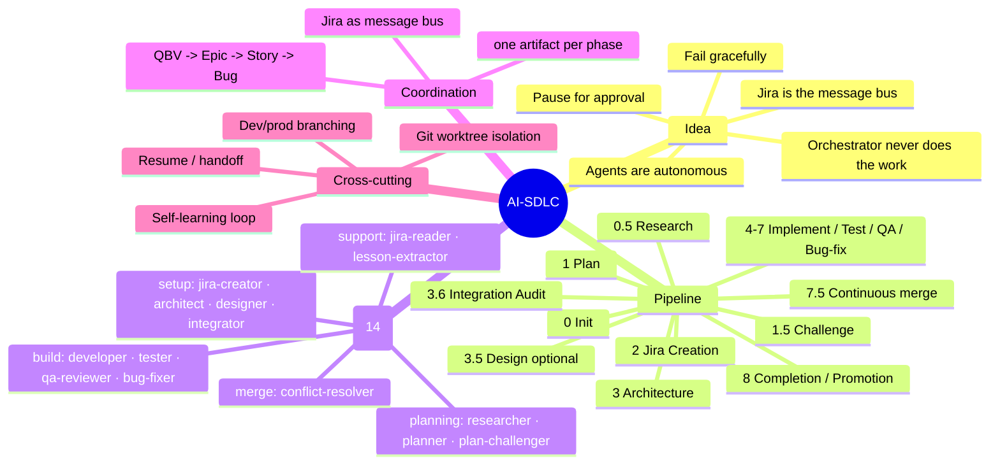
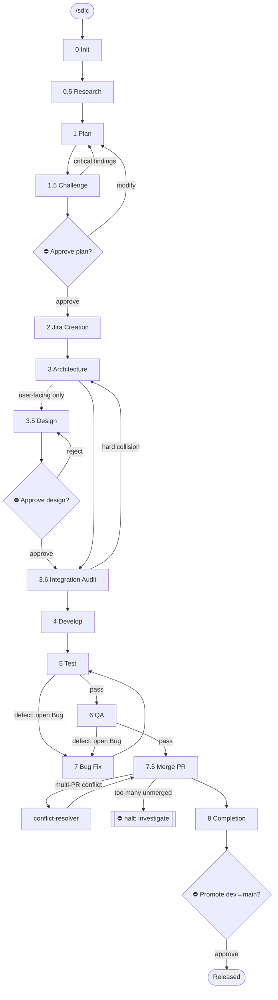
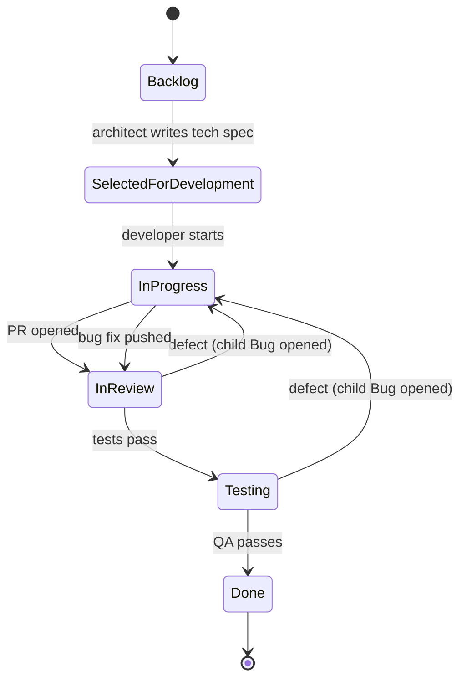
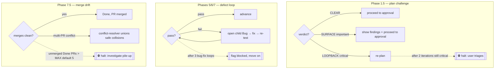
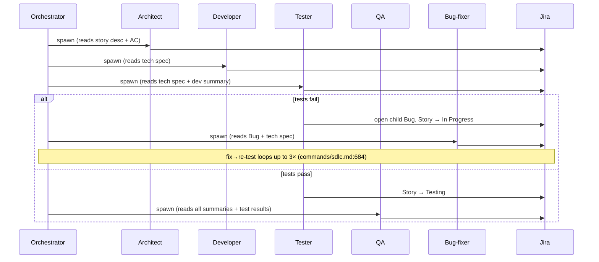
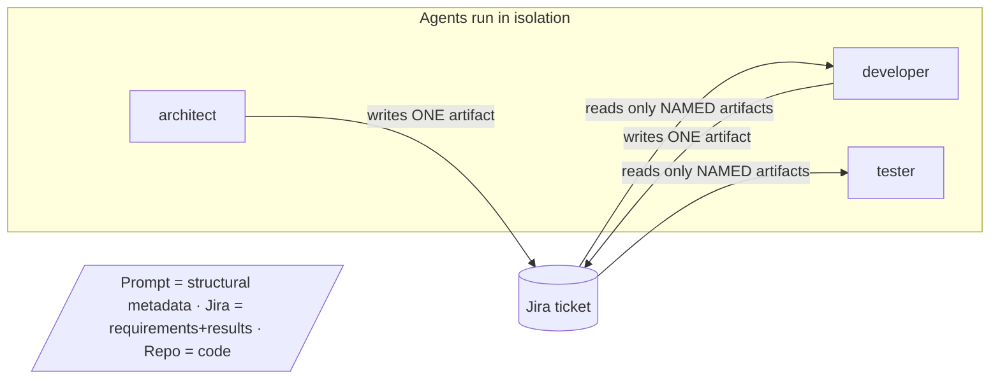

# AI-SDLC — How the System Works

> **How to read this.** The doc goes idea → flow → decisions, then splits by who you are.
> Start at [The Idea](#the-idea). If you just want to *use* it, read through
> [The Flow](#the-flow) and stop at the [First-time user](#for-a-first-time-user) view. If you
> *run* it on real projects, continue to the [Operator](#for-an-operator) view. If you want to
> *change* it, read the [Contributor](#for-a-contributor) view.
>
> Facts are cited as `file:line` against the source. They were true when this was written;
> the pipeline changes, so treat a mismatched citation as a signal to regenerate, not as truth.

---

## The Idea

AI-SDLC is an **automated software development lifecycle**. You start it with one command —
`/sdlc "build me X"` — and a single **orchestrator** drives a project from a rough description
all the way to merged, tested code, coordinating a team of specialized AI agents along the way.

The load-bearing concepts, straight from the source:

- **Jira is the message bus.** Agents don't talk to each other. Each one reads its inputs from a
  Jira ticket and writes its output back as a ticket comment. The ticket's *status* is how the
  orchestrator knows what to do next. (`commands/sdlc.md:13`, `skills/sdlc-conventions/SKILL.md:19`)
- **Agents are autonomous and isolated.** Each runs on its own with full context pulled from Jira —
  no shared memory, no side channels. (`commands/sdlc.md:14`)
- **The orchestrator coordinates but never does the work itself.** It does not write code, fix bugs,
  write tests, or do QA — *even a one-line fix goes through an agent* so the work stays tracked and
  follows the pipeline. This is the counter-intuitive rule that makes the whole thing consistent:
  the value comes from never taking shortcuts. (`commands/sdlc.md:16-17`)
- **The pipeline pauses for you.** It stops and asks for approval at specific gates — after
  planning, before UI development, and before promoting to production. You are always in the loop
  at the moments that matter. (`commands/sdlc.md:15`)
- **It fails gracefully.** Retries are bounded; when a loop can't converge, it flags the work for a
  human instead of spinning forever. (`commands/sdlc.md:15`)

Here's the whole system in one picture — the parts and how they group:

*(Agent count and phase list derived from `ls agents/*.md` — 14 files — and the `## Phase` headings
in `commands/sdlc.md:248-760`.)*

---

## The Flow

Work moves through numbered **phases**. The numbering is not 1..8 — it has fractional phases
(`0.5`, `1.5`, `3.5`, `3.6`, `7.5`) that were inserted as the pipeline matured, and one combined
phase (`4-7`) that is really a per-story loop. Read them off the source, never assume the count.
(`commands/sdlc.md:248-760`)

| Phase | Name | Who runs it | What it produces | Gate? |
|------:|------|-------------|------------------|-------|
| 0 | Initialization | orchestrator | context block, transition map, agent paths, branching model | — |
| 0.5 | Research (build-vs-buy) | `sdlc-researcher` | OSS survey report (advisory) | — |
| 1 | Planning | `sdlc-planner` | epic/story breakdown with acceptance criteria | — |
| 1.5 | Plan Challenge | `sdlc-plan-challenger` | adversarial findings + verdict | — |
| — | **Approve the plan** | **user** | plan approved (or sent back) | ⛔ **pause** |
| 2 | Jira Ticket Creation | `sdlc-jira-creator` | QBV + epics + stories in Jira | — |
| 3 | Architecture | `sdlc-architect` | Critical User Journeys + tech spec per story | — |
| 3.5 | Design *(optional)* | `sdlc-designer` | design spec for user-facing stories | ⛔ **pause** |
| 3.6 | Integration Audit | `sdlc-integrator` | cross-story collision notes | — |
| 4 | Develop | `sdlc-developer` | code, commit, PR → *In Review* | — |
| 5 | Test | `sdlc-tester` | tests + results (Playwright E2E for UI) | — |
| 6 | QA Review | `sdlc-qa-reviewer` | QA verdict → *Done* or a Bug | — |
| 7 | Bug Fix | `sdlc-bug-fixer` | fix → back to *In Review* | — |
| 7.5 | Continuous merge | orchestrator / `sdlc-conflict-resolver` | Done PRs merged into base | ⛔ pause *if pile-up* |
| 8 | Completion + Promotion | orchestrator | epic summary, CUJ replay, dev→main promotion | ⛔ **pause** |

*(Phases and owners from `commands/sdlc.md:248-802`; owner-to-model mapping from the table at
`commands/sdlc.md:127-142`.)*

The same thing as a flowchart, with the loops and gates drawn in — the loops are the point, so
they're not hidden:

*(Back-edges: challenge loopback `commands/sdlc.md:474`; integration-audit loopback
`commands/sdlc.md:583`; defect loop `commands/sdlc.md:668-684`; merge-conflict routes
`commands/sdlc.md:733-748`; drift halt `commands/sdlc.md:750-754`.)*

### How a ticket moves (the state machine)

The *phases* are what the pipeline does; the *statuses* are where a Story ticket sits. They're
orthogonal. A Story walks this path (`skills/sdlc-conventions/references/workflow-states.md:5`,
`SKILL.md:20-27`):

> **A Bug is a *type*, not a status.** When the tester or QA finds a defect, they open a **child
> Bug issue** parented to the Story and move the Story back to *In Progress*. While that Bug is
> open, the parent Story sits in *In Progress*. You detect "is this Story in the bug loop?" by
> querying its children (`parent = X AND issuetype = Bug AND status != Done`), **not** by reading
> the Story's own status. (`workflow-states.md:9-11,42-52`)

---

## For a First-time User

**What you're actually driving.** You are not chatting with a coder. You're starting a pipeline
and approving it at a few checkpoints. Everything in between runs on its own.

**How to start:**
- `/sdlc "a description of what you want"` — brand-new project (`commands/sdlc.md:2-3`)
- `/sdlc /path/to/plan.md` — start from a plan file you already wrote
- `/sdlc CSI-123` — **resume** an existing epic where you left off (`commands/sdlc.md:1150-1160`)

**The three moments it will stop and wait for you** — this is what you'll actually experience:

1. **After planning** — it shows you the epic/story breakdown *plus* an adversarial review of that
   plan, and asks *"Approve this plan? Or modify?"*. Nothing gets created in Jira until you say yes.
   (`commands/sdlc.md:476-483`)
2. **Before building anything with a user interface** — if a story has a UI, CLI output, or a
   dashboard, a designer proposes the look and asks *"Approve this design? Or modify?"* before any
   code is written. Pure backend stories skip this. (`commands/sdlc.md:534-565`)
3. **Before going to production** — when everything's done on the `dev` branch, it asks
   *"Promote to `main`?"* before shipping. (`commands/sdlc.md:799`)

Between those, it plans, files tickets, designs the architecture, writes the code, tests it (real
browser tests for anything user-facing), reviews it, fixes its own bugs, and merges the PRs — all
tracked in Jira so you can watch it happen on the board.

**One thing that surprises people:** if the plan has a serious flaw, an internal "challenger"
catches it and sends it back for a rewrite *before you ever see it* — so the plan you're asked to
approve has already survived a round of criticism. (`commands/sdlc.md:459-474`)

---

## For an Operator

You're running this on a live project and need to recognize every state and every pause.

### Reading the board

Use the [state machine above](#how-a-ticket-moves-the-state-machine). The exact status strings you
will see are: **Backlog · Selected for Development · In Progress · In Review · Testing · Done**
(synonyms `To Do` / `Ready for Dev` are mapped at Phase 0).
(`workflow-states.md:5-16`, `commands/sdlc.md:1152-1160`)

Each phase posts **exactly one artifact comment** whose header tells you it succeeded. Watch for
these headers on the ticket (`SKILL.md:154-171`, `commands/sdlc.md` per-phase Write Artifact lines):

| Phase | Artifact header it posts | Status it moves to |
|------|--------------------------|--------------------|
| Architecture | `## Critical User Journeys` (epic) + `## Technical Specification` (story) | Selected for Development |
| Design | `## Design Specification` | (stays, awaits approval) |
| Integration | `## Integration Notes` (only if collisions) | — |
| Develop | `## Implementation Complete` | In Review |
| Test | `## Test Results` | Testing (pass) / In Progress (fail) |
| QA | `## QA Review` | Done (pass) / In Progress (fail) |
| Bug fix | `## Bug Fix Complete` | In Review |
| Merge | `## Merge Result` | (Done, PR merged) |

### The decision points and their caps

Every place the flow branches, and — critically — **where it stops and asks you**:

The caps you must know, verbatim from source:

- **Plan challenge:** at most **2 challenge iterations** per session; a third still-critical round
  halts for you to triage. (`commands/sdlc.md:474`)
- **Integration audit:** at most **2 audit iterations** per epic; a third halts for you.
  (`commands/sdlc.md:583`)
- **Bug-fix loop:** a Story goes through fix → re-test at most **3 times**; after that it's flagged
  blocked and the pipeline moves on. (`commands/sdlc.md:684`, `workflow-states.md:57`)
- **Merge drift:** if more than `MAX_UNMERGED_DONE_PRS` (env, **default 5**) Done PRs are unmerged,
  the pipeline **halts** and asks you to investigate — this is the conflict-pile-up alarm Phase 7.5
  exists to trip. (`commands/sdlc.md:698,750-754`)

### One story's life, across agents

### Pausing and resuming safely

- **Auto-save** happens at batch boundaries and when context exceeds 60% — a resume file is written
  with no confirmation. (`commands/sdlc.md:834-846`)
- **Explicit handoff** — say "pause" / "stop" / "save progress" and it runs the full `sdlc-handoff`
  skill: scans git state, offers a checkpoint commit, captures decisions/blockers.
  (`commands/sdlc.md:862-874`)
- **Resume** with `/sdlc CSI-123`; Phase 0 fast-resume reloads the cached context and only re-routes
  stories whose status drifted. (`commands/sdlc.md:252-270`)

### Self-learning (it improves itself)

As the pipeline runs, hooks capture two kinds of lessons — **your corrections** and agents'
self-reported `## Lessons` — into an append-only journal. The orchestrator "drains" that queue,
spawns `sdlc-lesson-extractor` to classify each, and surfaces a **proposal** for your approval
before changing any canonical file. You can toggle it (`/sdlc lessons on|off`) and switch between
immediate (mode 1) and batched (mode 2) surfacing. (`commands/sdlc.md:892-1006`)

---

## For a Contributor

You want to add or modify an agent or a phase without breaking coordination. Read the source files
by the paths below — this section is the map, not a substitute for reading them.

### The coordination contract

Agents never call each other. They share context through exactly three channels
(`SKILL.md:56-64`):

The discipline that keeps this cheap (`SKILL.md:146-224`):

- **One artifact per phase.** Each agent posts exactly one comment at the end of its phase; the
  orchestrator's prompt names which prior artifacts it may read. Agents do **not** scan the whole
  thread. If an agent needs something not listed, it stops and asks. (`SKILL.md:150-164`)
- **Summary-first.** Every artifact opens with a `## Summary` of 3–5 bullets; detail lives below and
  is read on demand with `offset`/`limit`. (`SKILL.md:166-184`)
- **Never store** full test output, code snippets, restated requirements, or file contents in Jira —
  reference commit SHA + path; the worktree is the source of truth. (`SKILL.md:186-198`)

### How agents are spawned (the part that trips people up)

Plugin subagents **cannot access MCP tools** — a Claude Code platform limitation. Every SDLC agent
needs Jira MCP access, so they are **all** spawned as **general-purpose agents** via `Agent()` with
**no `subagent_type`**. (`commands/sdlc.md:30-34,120-124`)

The spawn is **pointer-not-body**: the orchestrator passes the *path* to the agent's role file and
the agent reads its own definition as its first action. Reading the body in the orchestrator would
inline ~2k tokens per spawn across 7–9 spawns per epic. Agent paths are resolved once via a single
Glob in Phase 0 and reused. (`commands/sdlc.md:36-48`, `commands/sdlc.md:293-317`)

Model tier is hardcoded per role (`commands/sdlc.md:127-142`) — opus for reasoning-heavy roles
(researcher, planner, plan-challenger, architect, designer, developer, qa-reviewer), sonnet for the
rest (jira-creator, integrator, tester, bug-fixer, conflict-resolver, jira-reader, lesson-extractor).

### Workspace isolation

Any agent that touches the repo runs in a **dedicated git worktree**, one per story:
`{repo_path}.worktrees/{STORY-KEY}` on branch `{STORY-KEY}/{slug}`. Different stories → different
worktrees → safe parallelism. Same-story agents (developer → tester → QA → bug-fixer) share one
worktree and run sequentially. **Never** point two concurrent agents at the same worktree.
(`commands/sdlc.md:595-643`, `SKILL.md:300-324`)

### Where the source of truth lives

| Concern | File |
|---|---|
| Principles, phases, gates, spawn protocol, self-learning, resume | `commands/sdlc.md` |
| Each agent's role, inputs, outputs, decisions | `agents/sdlc-*.md` (14 files) |
| Jira conventions, artifact discipline, worktrees, branching | `skills/sdlc-conventions/SKILL.md` |
| Statuses, bug lifecycle, retry cap | `skills/sdlc-conventions/references/workflow-states.md` |
| Context-passing protocol | `skills/sdlc-conventions/references/context-protocol.md` |
| Design rationale (the "why") | `docs/specs/*.md`, `docs/plans/*.md` |

**Rule when adding an agent or phase:** behavior is defined in the orchestrator (`commands/sdlc.md`)
plus the agent's own role file, and shared conventions in `sdlc-conventions`. A new phase must post
a single artifact with a `## Summary` header, transition tickets through the existing status set (or
map new statuses in Phase 0), and be spawned pointer-not-body as a general-purpose agent. Dynamic
agents (work no `sdlc-<role>` owns) require the 5-point validity test and, in the current autonomy
level, an explicit user gate before spawning. (`commands/sdlc.md:18`)

---

## Keeping this document honest

This file was generated by surveying the source and citing `file:line`. The pipeline changes —
phases get inserted, agents get added, caps get tuned. **Do not hand-edit the facts here.** When
something drifts, re-run the `sdlc-explainer` skill: it re-surveys the current source and
regenerates this document so the numbers, the roster, and the diagrams match reality again.
