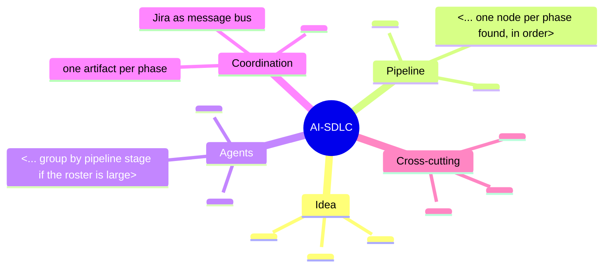
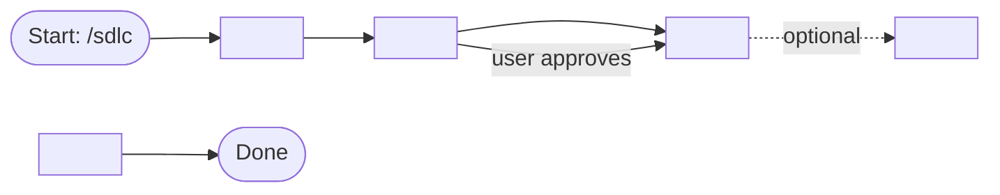
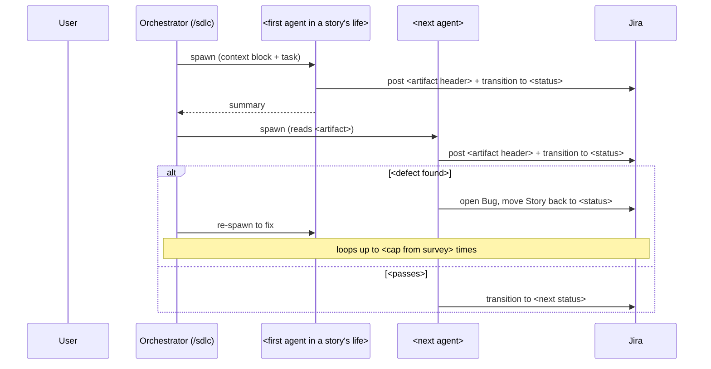
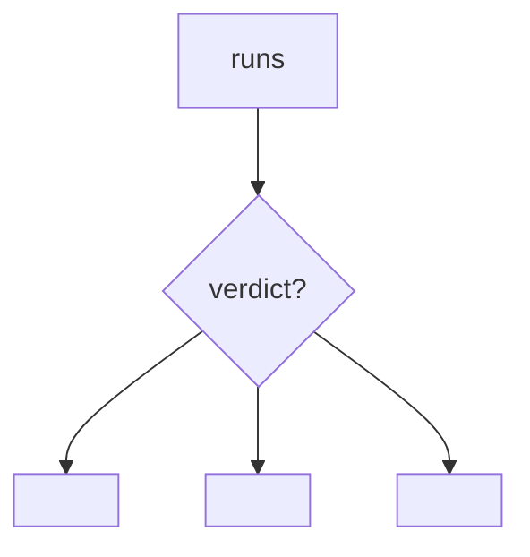
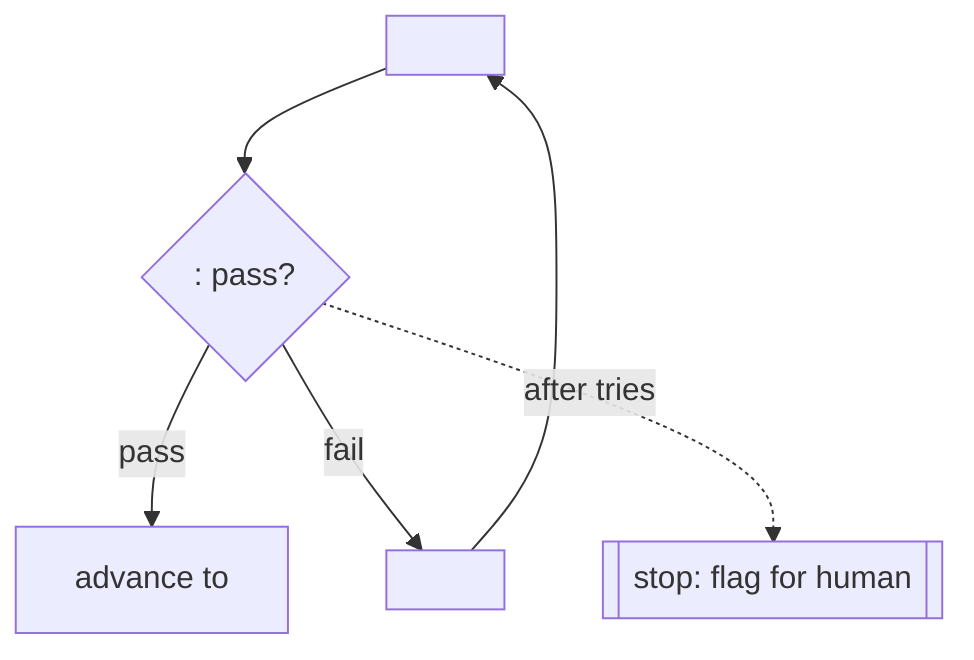
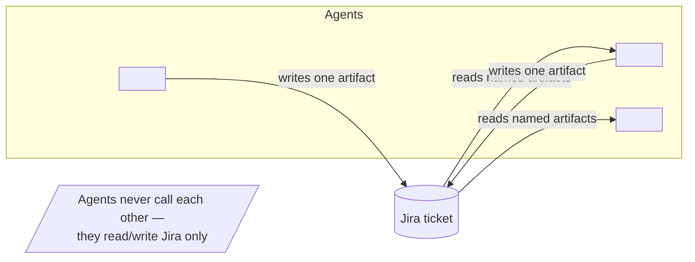

# Diagram Cookbook — fill-from-source templates

These are **skeletons**, not finished diagrams. Each has placeholders (`<…>`) you populate from your Step-1 survey digest, so the picture reflects the system as it is *today*. Never paste a template as-is — a diagram with `<phase name>` still in it, or one that omits a loop the survey found, is worse than no diagram.

For the diagram *syntax itself* (valid Mermaid grammar, escaping, styling), defer to the `architecture-diagrams` skill. This file only gives the *shape* keyed to AI-SDLC concepts.

## Table of contents
1. Whole-system mind map
2. Phase flowchart (the pipeline)
3. Story lifecycle (sequence diagram)
4. Jira state machine (state diagram)
5. Decision / loop patterns (verdicts, gates, retry caps)
6. Coordination model (how agents share context)

Default to Mermaid — it renders without tooling. All examples below are Mermaid.

---

## 1. Whole-system mind map

Best first picture for a newcomer: one glance shows the parts and how they group. Populate the branches from your survey (principles, phases, agents, coordination, cross-cutting systems). Add or drop branches to match what you actually found.

Keep leaf labels short — a mind map is a map, not prose. If the agent roster is long, group agents under the phase where they run rather than listing all at the root.

---

## 2. Phase flowchart (the pipeline)

The core "how work flows" picture. One node per phase **in the order the survey found them**. Do not hardcode a count — emit exactly the phases that exist.

Checklist before you ship this diagram:
- Every phase from the survey appears exactly once, in order.
- Optional/skippable phases are visually distinct from always-run ones.
- Every human-approval gate is annotated on the edge where it happens.
- Every back-edge (loopback, defect loop, retry) the survey found is drawn. The loops are the point.

Use `flowchart LR` for a wide pipeline (reads left-to-right like a timeline); `flowchart TD` if it's tall or has many branches.

---

## 3. Story lifecycle (sequence diagram)

Shows one story's journey **across agents over time** — the best way to convey "who hands off to whom". Participants are the orchestrator + the agents a story actually touches (from your survey). Include a defect detour so the reader sees the loop, not just the happy path.

Populate participants and artifact headers from the survey. If the survey found a retry cap, state it in the `Note`. Don't invent handoffs — draw only the ones the source describes.

---

## 4. Jira state machine (state diagram)

Shows the **statuses a story moves between** — orthogonal to the phase flow (phases are what the pipeline does; states are where the ticket sits). Use the exact status names from the survey.

```mermaid
stateDiagram-v2
  [*] --> <first status>
  <first status> --> <next status> : <who / what advances it>
  <next status> --> <next status> : ...
  %% ... one transition per status pair the survey found ...
  <terminal status> --> [*]

  %% Defect back-edge — include if the survey found one:
  <a downstream status> --> <an earlier status> : defect (Bug opened)
  <earlier status> --> <a downstream status> : fix pushed
```

If defects are modeled as a separate issue type (rather than a status), show that in a note — e.g. `note right of <status>: a Bug is a child issue; parent sits here while it's open`. Match whatever the survey found; don't impose a model.

---

## 5. Decision / loop patterns

The decision points are the richest part of the explanation. For **each** branch the survey found, draw a small focused flowchart rather than cramming them all into the phase diagram. Two reusable shapes:

### Verdict routing (an agent returns one of several verdicts)

Use the **verbatim** verdict labels from the source — readers will grep for them. One outcome node per verdict.

### Gate with a capped retry loop

Always draw the cap edge — "loops forever" is never the real behavior; the survey will have found the limit and the human-escalation exit.

---

## 6. Coordination model (how agents share context)

Explains the "Jira as message bus + one artifact per phase" idea visually — why agents don't talk directly.

Pair this with a one-line explanation of the artifact-discipline contract (each agent reads only the artifacts its prompt names, writes exactly one). Pull the specifics from the conventions skill in your survey.

---

## Rendering & format notes

- **Terminal / GitHub / most Markdown viewers** render Mermaid natively — the reader sees the picture with zero setup. This is why it's the default.
- If a reader needs **cloud-provider icons**, an editable `.drawio`, or PlantUML-specific features, hand off to the `architecture-diagrams` skill and let it pick the format.
- Test a diagram mentally before shipping: does it read correctly top-to-bottom / left-to-right? Are all labels populated (no stray `<…>`)? Does it include the loops? If yes, it's honest.
