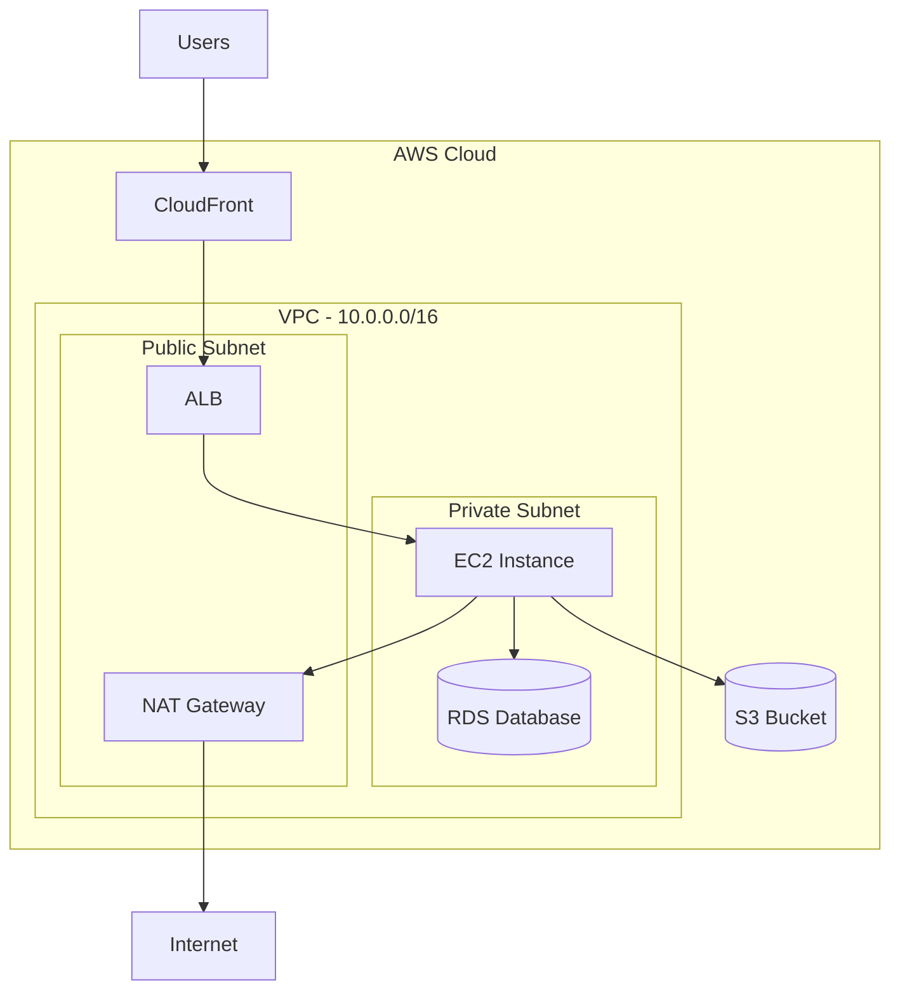

# Cloud Infrastructure Diagrams

For AWS, Azure, or GCP architecture diagrams with native service icons.

## PlantUML (Recommended for Cloud Diagrams)

PlantUML has the richest cloud icon library.

### AWS Example

```plantuml
@startuml
!include <awslib/AWSCommon>
!include <awslib/AWSSimplified>
!include <awslib/Compute/Lambda>
!include <awslib/NetworkingContentDelivery/APIGateway>
!include <awslib/NetworkingContentDelivery/VPCEndpoints>
!include <awslib/NetworkingContentDelivery/NATGateway>
!include <awslib/NetworkingContentDelivery/AWSNetworkFirewall>
!include <awslib/SecurityIdentityCompliance/WAF>

rectangle "Private Account\n(No Internet)" as priv #f5f5f5 {
    node "Workload\n(ECS/Lambda)" as work
    VPCEndpoints(vpce, "VPC Endpoint", "execute-api")
}

rectangle "Egress Proxy Account" as proxy #e3f2fd {
    WAF(waf, "WAF", "Rate limit + inspection")
    APIGateway(apigw, "API Gateway", "Private + Resource Policy")
    Lambda(fn, "Proxy Function", "Auth + routing")
    AWSNetworkFirewall(nfw, "Network Firewall", "Domain allowlist")
    NATGateway(nat, "NAT Gateway", "Egress only")
}

cloud "Internet" {
    node "SaaS API" as saas #fff3e0
}

work --> vpce
vpce --> apigw : AWS Backbone
apigw --> waf
waf --> fn
fn --> nfw
nfw --> nat
nat --> saas : HTTPS/443 only

@enduml
```

### Common AWS Includes

```
!include <awslib/Compute/Lambda>
!include <awslib/Compute/EC2>
!include <awslib/Compute/ECS>
!include <awslib/Database/RDS>
!include <awslib/Database/DynamoDB>
!include <awslib/Storage/S3>
!include <awslib/NetworkingContentDelivery/VPC>
!include <awslib/NetworkingContentDelivery/APIGateway>
!include <awslib/NetworkingContentDelivery/CloudFront>
!include <awslib/NetworkingContentDelivery/Route53>
!include <awslib/NetworkingContentDelivery/NATGateway>
!include <awslib/NetworkingContentDelivery/TransitGateway>
!include <awslib/NetworkingContentDelivery/VPCEndpoints>
!include <awslib/NetworkingContentDelivery/AWSNetworkFirewall>
!include <awslib/SecurityIdentityCompliance/IAM>
!include <awslib/SecurityIdentityCompliance/KMS>
!include <awslib/SecurityIdentityCompliance/WAF>
!include <awslib/SecurityIdentityCompliance/GuardDuty>
!include <awslib/ManagementGovernance/CloudWatch>
!include <awslib/ManagementGovernance/CloudTrail>
```

## Mermaid (Cloud Diagrams)

Mermaid doesn't have native cloud icons, but you can use subgraphs and emoji/text to indicate services:



### Tips for Mermaid cloud diagrams
- Use nested `subgraph` for VPC → Subnet hierarchy
- Use `[("Name")]` for databases/storage (cylinder shape)
- Use `["Name"]` for compute/services (rectangle)
- Add CIDR ranges and ports in subgraph labels and edge labels

## Draw.io (Cloud Diagrams)

Draw.io has built-in AWS/Azure/GCP shape libraries. Key shape prefixes:

**AWS 2024 shapes**:
```
shape=mxgraph.aws4.resourceIcon;resIcon=mxgraph.aws4.lambda
shape=mxgraph.aws4.resourceIcon;resIcon=mxgraph.aws4.api_gateway
shape=mxgraph.aws4.resourceIcon;resIcon=mxgraph.aws4.s3
shape=mxgraph.aws4.resourceIcon;resIcon=mxgraph.aws4.vpc
shape=mxgraph.aws4.resourceIcon;resIcon=mxgraph.aws4.rds
```

**Group containers** (for VPCs, accounts):
```
shape=mxgraph.aws4.group;grIcon=mxgraph.aws4.group_vpc
shape=mxgraph.aws4.group;grIcon=mxgraph.aws4.group_account
shape=mxgraph.aws4.group;grIcon=mxgraph.aws4.group_region
shape=mxgraph.aws4.group;grIcon=mxgraph.aws4.group_private_subnet
shape=mxgraph.aws4.group;grIcon=mxgraph.aws4.group_public_subnet
```

When generating Draw.io XML for cloud diagrams, use these native shapes instead of generic rectangles for a professional look.
