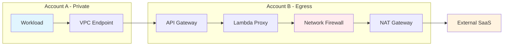
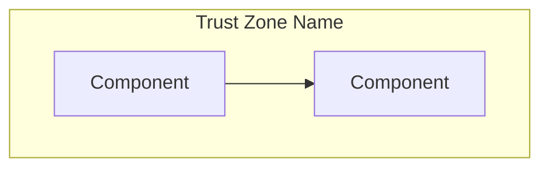

# Flowchart / Architecture Diagrams

## Mermaid



### Key patterns

**Subgraphs** for trust boundaries:


**Styling** for semantic color:
```
style NodeID fill:#color,stroke:#color,color:#textcolor
```

**Direction options**: `LR` (left-right), `TB` (top-bottom), `RL`, `BT`

**Node shapes**:
- `[Rectangle]` — services, components
- `([Stadium])` — start/end points
- `{Diamond}` — decisions
- `[(Database)]` — data stores
- `((Circle))` — events, triggers

**Arrow labels**:
```
A -->|HTTPS/443| B
A -.->|async| C
A ==>|critical path| D
```

## PlantUML

```plantuml
@startuml
!include <awslib/AWSCommon>
!include <awslib/Compute/Lambda>
!include <awslib/NetworkingContentDelivery/APIGateway>
!include <awslib/NetworkingContentDelivery/VPCEndpoints>

rectangle "Private Account" {
    node "Workload" as work
    VPCEndpoints(vpce, "VPC Endpoint", "Interface")
}

rectangle "Egress Account" {
    APIGateway(apigw, "API Gateway", "Private")
    Lambda(proxy, "Proxy", "Auth injection")
}

cloud "Internet" {
    node "SaaS API" as saas
}

work --> vpce : HTTPS
vpce --> apigw : AWS Backbone
apigw --> proxy
proxy --> saas : HTTPS/443

@enduml
```

### Key patterns

**AWS icons**: Use `!include <awslib/Category/ServiceName>` then the macro `ServiceName(id, label, description)`.

**Grouping**: `rectangle "Name" { ... }` for trust boundaries.

**Arrow styles**:
- `-->` solid
- `..>` dashed
- `-[#red]->` colored
- `-->` with label: `A --> B : label text`

## Draw.io

For Draw.io, generate XML that can be imported. Basic structure:

```xml
<mxfile>
  <diagram name="Architecture">
    <mxGraphModel>
      <root>
        <mxCell id="0"/>
        <mxCell id="1" parent="0"/>
        <!-- Group for trust boundary -->
        <mxCell id="2" value="Private Account" style="rounded=1;whiteSpace=wrap;dashed=1;fillColor=#f5f5f5;" vertex="1" parent="1">
          <mxGeometry x="40" y="40" width="300" height="200" as="geometry"/>
        </mxCell>
        <!-- Component -->
        <mxCell id="3" value="Workload" style="rounded=1;whiteSpace=wrap;fillColor=#e1f5fe;" vertex="1" parent="2">
          <mxGeometry x="40" y="60" width="120" height="60" as="geometry"/>
        </mxCell>
        <!-- Arrow -->
        <mxCell id="10" value="HTTPS" style="edgeStyle=orthogonalEdgeStyle;" edge="1" source="3" target="4" parent="1">
          <mxGeometry relative="1" as="geometry"/>
        </mxCell>
      </root>
    </mxGraphModel>
  </diagram>
</mxfile>
```

### Key patterns

**Styles**:
- `fillColor=#e1f5fe` — light blue (AWS)
- `fillColor=#fff3e0` — light orange (external)
- `fillColor=#ffebee` — light red (security)
- `dashed=1` — dashed border for trust boundaries
- `rounded=1` — rounded corners

**AWS shapes**: Draw.io has built-in AWS shapes. Use `shape=mxgraph.aws4.` prefix:
- `shape=mxgraph.aws4.lambda_function`
- `shape=mxgraph.aws4.api_gateway`
- `shape=mxgraph.aws4.vpc`
