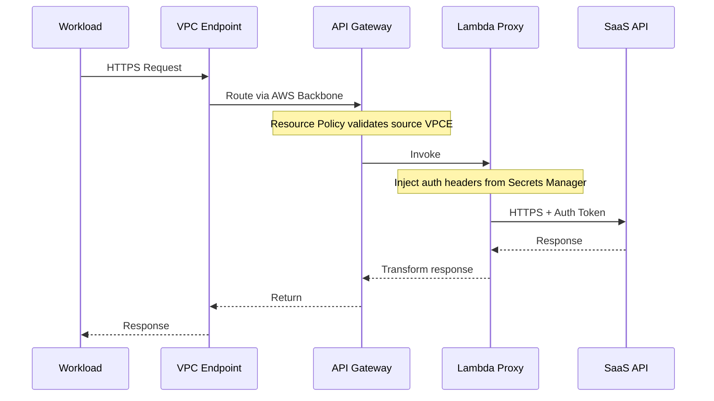
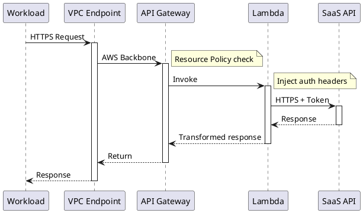

# Sequence Diagrams

## Mermaid



### Key patterns

**Participants**: Define them upfront with aliases for readability.
```
participant Alias as "Display Name"
```

**Arrow types**:
- `->>` solid with arrowhead (request)
- `-->>` dashed with arrowhead (response)
- `->>+` activate target (shows execution bar)
- `-->>-` deactivate (ends execution bar)

**Notes**: Use to annotate security controls and decisions.
```
Note over A: Validates token
Note over A,B: Encrypted with TLS 1.2
Note right of A: Check rate limit
```

**Loops and conditions**:
```
alt Success
    A->>B: 200 OK
else Failure
    A->>B: 403 Forbidden
end

loop Retry 3 times
    A->>B: Request
end
```

**Activation** (shows which component is processing):
```
A->>+B: Request
B-->>-A: Response
```

## PlantUML



### Key patterns

**Colors and styling**:
```
participant "Name" as A #LightBlue
```

**Dividers** (separate phases):
```
== Authentication Phase ==
A -> B : Login
== Data Phase ==
A -> B : Request
```

**Groups**:
```
group Security Validation
    A -> B : Validate
    B -> C : Check
end
```
